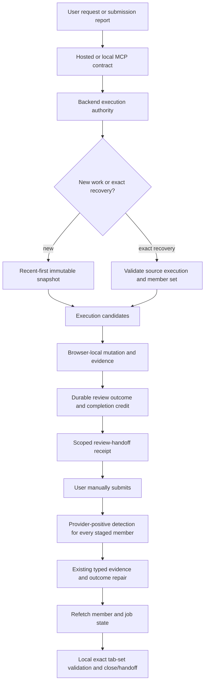

# Trackly Apply Durable Recovery and Reconciliation - Plan

## Goal Capsule

- **Objective:** Make Trackly Apply recover the exact interrupted jobs, preserve cumulative completion, reconcile every member in a submitted handoff, and fail closed around browser cleanup and resume upload.
- **Authority:** The backend owns membership, lifecycle, completion credit, idempotency, and current state. The browser harness owns live DOM evidence and local tab identity. The user owns Submit, credentials, verification challenges, and ambiguous answers.
- **Execution profile:** Deep, cross-repository reliability work in `close-ai` and `trackly-cli`. Use fresh worktrees from current `origin/main`; keep base checkouts read-only.
- **Stop conditions:** Stop browser mutation on unexpected recovery membership, stale inspection authority, ambiguous submission state, incomplete tab inventories, unproven attachment state, or incompatible protocol versions.
- **Tail ownership:** Merge and deploy the backend first. Then publish and install the compatible CLI and skill. Finish with no-submit fixtures and a manually submitted dogfood recovery flow.

---

## Product Contract

### Summary

The August 5 live session proved that Trackly Apply's safety boundary works, but several lifecycle guarantees remain reconstructed from mutable state or expressed only as skill prose. A browser restart can restore tabs without restoring form values or mutation authority. A manual submission can invalidate the evidence projection used to count a ready sibling. A grouped “submitted all” message has no durable handoff scope. Browser finalization can receive an empty keep set after mixed tab-ID types. Resume upload failures do not identify the failed stage.

This release converts those gaps into backend state, additive MCP operations, deterministic local helpers, provider-aware browser rules, and faithful integration tests. It preserves the existing manual-submit boundary, compact profile model, execution-scoped resume approval, field-provenance rules, and provider-neutral backend evidence.

### Problem Frame

Current `main` already defines target completion as `durablyReviewReady + submitted >= target`, already supports in-run `recovery_binding`, and already repairs several stale submitted projections. The incident therefore cannot be fixed by changing the final boolean formula or by adding another paragraph to the skill. The missing guarantees are durable review achievement, exact expired-member recovery, precise handoff scope, enforceable local tab-set validation, and observable upload stages.

The implementation must separate three restart receipts:

1. The tab and requisition URL were restored.
2. The ATS form values were restored or proven lost.
3. Trackly mutation authority was restored for the exact member and a fresh inspection epoch.

None of these receipts implies another.

### Requirements

**Execution state and recovery**

- R1. Trackly must persist one cumulative completion credit per execution candidate after the candidate first reaches durable manual review or a valid submitted-state repair.
- R2. A credited candidate must continue counting after manual submission; submitting it must not create replacement capacity.
- R3. Execution status, raw cumulative achievement count, target-capped `completed`, current ready/submitted counts, reservations, `targetReached`, and `nextAction` must come from one transactionally consistent state.
- R4. Trackly must recover the exact confirmed set from one prior terminal or expired execution only when every confirmed member is eligible, without changing queue recency or selecting newer jobs; otherwise it must create no recovery execution.
- R5. Exact recovery must assert the requested source membership, report each member's eligibility, create no substitutes, reuse valid run identity, and require a fresh browser binding and inspection epoch.
- R6. Exact recovery must reject foreign-user, revoked, changed-requisition, duplicate, and concurrently owned members. Already-applied members are reconciliation-only and inactive or access-blocked members remain typed non-counting dispositions.
- R7. Tab restoration, form restoration, and mutation authority must be exposed as separate value-free recovery facts.

**Review and submission reconciliation**

- R8. Replaying `review_ready` for the same run, member, batch, and inspection epoch must return the existing durable milestone without incrementing versions or duplicating events.
- R9. The review handoff must return a value-free receipt that binds the exact ordered member set shown to the user.
- R10. A user report such as “submitted all” must apply only to the exact referenced or latest unambiguous handoff receipt, never every ready job or only the focused tab.
- R11. After a staged-group submission report, the browser harness must inspect every member in that handoff with provider-specific positive success semantics. Unchanged URL or title must never serve as negative evidence.
- R12. Trackly must record typed submission evidence, reconcile member lifecycle to `submitted`, reconcile job state to `applied_confirmed`, and refetch both before the harness closes that member's tab.
- R13. Historical batch views must label their lifecycle as historical and expose the current run/job projection separately; historical rows remain immutable.

**Browser preservation and uploads**

- R14. Before finalization, a local helper must canonicalize opaque tab identifiers, reconcile complete controller and user inventories, and require exact expected-set and keep-set identity and cardinality.
- R15. A nonempty expected set with an empty, partial, stale, duplicated, or ambiguous keep set must block finalization. Raw tab identifiers must remain local.
- R16. Resume upload must follow a negotiated browser-surface sequence: identify the exact semantic upload control, arm the chooser before the click, attach the immediately verified file, verify the committed filename, and recheck parser-modified fields.
- R17. Upload failures must emit stable value-free stage codes without local paths, filenames, page text, or profile values.
- R18. User-edited and unknown nonempty fields must keep their current byte-preservation behavior across recovery, resume parsing, rerenders, and final sweeps.

**Operator and compatibility contract**

- R19. Every recovery or review handoff must state completed work, unresolved members, the user's next action, the exact resume phrase or observable event, the agent's next action, the browser surface, the three recovery receipts when applicable, and the authoritative funnel.
- R20. Hosted and local MCP must expose the same public recovery and reconciliation contracts. Local-only tab/upload helpers must be named exceptions and must never send raw browser identifiers or local file data to Trackly.
- R21. The backend protocol must publish bounded declarative success strategies for Greenhouse, Ashby, and Lever. It must never publish executable selectors or ingest raw DOM text.
- R22. The agent must never activate Submit, enter credentials or verification codes, solve a CAPTCHA, invent an answer, or weaken the current resume and origin gates.
- R23. After complete local context loss, an authenticated user must be able to list their bounded recoverable source executions and stable candidate identities, then explicitly confirm the exact set before recovery creation.

### Key Flows

- F1. Exact interrupted-member recovery
  - **Trigger:** A prior execution expired or ended after tabs or form state were lost.
  - **Actors:** User, Trackly backend, MCP client, browser harness.
  - **Steps:** The client lists bounded backend-owned recoverable source summaries when local identity is absent; the user confirms the exact candidate set; the client requests those source candidates; before creation, the backend validates the immutable source set and confirms that every requested candidate is eligible; only then does the backend create one exact recovery execution; the harness verifies returned membership; the harness obtains fresh browser and mutation receipts; the harness rehydrates only blank or agent-owned controls.
  - **Outcome:** Either the full confirmed set becomes mutable or no recovery execution is created. Queue ordering is unchanged.
  - **Covered by:** R4-R7, R18, R22-R23.

- F2. Cumulative two-job completion
  - **Trigger:** Two members reach durable review and the user submits one.
  - **Actors:** User, browser harness, Trackly backend.
  - **Steps:** Both candidates receive completion credit; the user submits one; Trackly records evidence and current submitted state; the sibling stays current review-ready; the completed count stays two.
  - **Outcome:** The execution remains target-reached and schedules no replacement.
  - **Covered by:** R1-R3, R8, R12.

- F3. Group submission reconciliation
  - **Trigger:** The user says “submitted all” after receiving one review handoff.
  - **Actors:** User, browser harness, Trackly backend.
  - **Steps:** The harness resolves the exact handoff receipt; inspects every staged tab; applies provider-positive detectors; records evidence for detected members; uses explicit confirmation only for unresolved members; refetches durable state; closes only verified submitted tabs.
  - **Outcome:** Every submitted job becomes Applied and every unresolved job remains preserved.
  - **Covered by:** R9-R13, R19, R21-R22.

- F4. Browser restart and form rehydration
  - **Trigger:** The browser process or controller restarts before Submit.
  - **Actors:** User, browser harness, Trackly backend.
  - **Steps:** The harness separately reports tab, form, and authority receipts; validates the exact recovered membership; increments inspection epoch; discards old browser evidence; preserves proven user values; rehydrates known blank values; repeats per-run resume verification before attachment.
  - **Outcome:** Recovery does not claim that restored tabs contain restored drafts.
  - **Covered by:** R4-R7, R16-R19.

- F5. Fail-closed session handoff
  - **Trigger:** A browser work turn ends with live unsent tabs.
  - **Actors:** Browser harness, local MCP helper.
  - **Steps:** The helper normalizes IDs, reconciles complete inventories, compares exact expected and keep sets, and returns a safe explicit keep list or a typed rejection.
  - **Outcome:** The finalizer runs exactly once only for a proven complete keep set.
  - **Covered by:** R14-R15, R19-R20.

### Acceptance Examples

- AE1. **Cumulative completion after one submission**
  - **Covers:** R1-R3.
  - **Given:** Target two and two candidates have durable review credit.
  - **When:** One candidate becomes submitted.
  - **Then:** `completed=2`, current ready is one, submitted is one, `targetReached=true`, `nextAction=complete`, and advance creates no wave.

- AE2. **Idempotent review replay**
  - **Covers:** R8.
  - **Given:** A run/member/epoch is already `awaiting_manual_submit` with valid durable gates.
  - **When:** The identical `review_ready` intent is repeated.
  - **Then:** The API returns `transition=replayed` and does not change member version or append a second milestone event.

- AE3. **Exact recovery with newer jobs present**
  - **Covers:** R4-R7.
  - **Given:** Two eligible expired source members and newer Check Later jobs exist.
  - **When:** The user requests recovery of those two source members.
  - **Then:** Both requested jobs, and no others, enter the recovery execution; queue timestamps remain unchanged.

- AE4. **Mixed exact recovery set**
  - **Covers:** R5-R7, R13.
  - **Given:** One source member is applied, one is recoverable, and one is inactive.
  - **When:** Recovery is requested for all three.
  - **Then:** Identity assertion and per-member eligibility evaluation cover all three, the request fails atomically, and no recovery execution or replacement is created.

- AE5. **Ashby same-route success**
  - **Covers:** R9-R12, R21.
  - **Given:** Two Ashby forms share one handoff and retain their application URLs.
  - **When:** One displays a semantic success banner and one still displays review controls.
  - **Then:** Only the first reconciles and closes; the second remains review-ready and visible.

- AE6. **Mixed-type finalizer IDs**
  - **Covers:** R14-R15.
  - **Given:** Expected tab IDs are numeric and controller IDs are strings.
  - **When:** The helper builds the keep set.
  - **Then:** Canonical IDs match, every expected tab is retained, and any missing identity blocks finalization.

- AE7. **Duplicate upload zones**
  - **Covers:** R16-R18.
  - **Given:** A form exposes Resume and Cover Letter controls plus hidden inputs.
  - **When:** The harness uploads the approved resume.
  - **Then:** It arms the chooser before clicking the semantic Resume control, verifies the resume filename in that control, and does not modify Cover Letter.

- AE8. **Second interruption during recovery**
  - **Covers:** R5, R7, R16-R18.
  - **Given:** Recovery uploaded the resume but did not reach review before another interruption.
  - **When:** The session resumes again.
  - **Then:** Browser evidence uses a new epoch, unchanged execution-scoped content approval may remain valid only when exact lineage still matches, and the per-run local file is verified again.

### Success Criteria

- The faithful Postgres sequence from the August 5 incident passes without projection contradictions.
- Exact recovery never mutates `saved_at`, never substitutes newer jobs, and never uses old-epoch evidence.
- Every grouped submission report produces one result per handoff member.
- No finalizer call receives an empty or partial keep set when expected tabs exist.
- Every upload failure identifies its stage without leaking local or applicant data.
- No execution exceeds its target or creates replacement work after a credited member is submitted.
- No agent path clicks Submit.

### Scope Boundaries

**Included now**

- Durable cumulative completion credit.
- Exact recovery from one prior execution.
- Idempotent review-ready replay.
- Scoped group reconciliation and Greenhouse/Ashby/Lever positive-success fixtures.
- Local fail-closed tab-set validation.
- Deterministic upload sequencing and value-free failure telemetry.
- Historical/current projection clarity and explicit operator handoffs.

**Deferred**

- Encrypted restoration of raw unsaved ATS drafts.
- Native Web, iOS, or macOS execution dashboard UI.
- General report-generation UI.
- A typed browser bridge embedded directly in the CLI.
- Arbitrary recovery across unrelated executions.
- Guaranteed automation for ATS platforms outside the current capability matrix.

**Human-only**

- Submit, credentials, account creation, OTP, CAPTCHA, permission prompts, ambiguous consent or legal answers, and manual upload when attachment state cannot be proven.

---

## Planning Contract

### Key Technical Decisions

- KTD1. **Persist completion credit in an append-only achievement ledger.** (session-settled: user-approved — chosen over concurrent unsubmitted inventory: once a job is ready or submitted it remains part of the requested total.) Create one value-free credit per `(execution_id, user_id, frozen_job_id)`, constrained to reviewed sources such as `review_ready` and `submitted_repair`. Insert the credit in the same transaction as the durable outcome. Expose `achievementCount` as the raw unique effective-credit count and compute target-facing `completed = LEAST(achievementCount, target)`. Credits are the sole target-achievement input; current ready/submitted counts remain operator projections. Do not add mutable columns to immutable execution candidates. A credit later proven to originate from invalid evidence may be neutralized only by an append-only compensating revocation through an audited internal repair operation; later submission or lifecycle change is never a revocation reason. Governs R1-R3.
- KTD2. **Characterize the live state sequence before changing accounting.** Current unit tests already cover `ready + submitted`, so implementation begins with a Postgres-backed checkpoint, certification, bulk-outcome, submission, and progress-read reproduction. A passing unit calculator test is not sufficient evidence. Governs R1-R3, R8.
- KTD3. **Model exact recovery as a new execution mode over stable source candidates.** The original August 5 decision used `recover_exact_members` with `sourceExecutionId`, exact execution-candidate IDs proven inside the source snapshot hash, optimistic revision, and idempotency key. It persisted `source_execution_id`, `source_candidate_id`, and the attempt-specific `source_member_id` when present; identity assertion was atomic, eligibility could be partial, and the server created no substitutes. Governs R4-R7.

  **Shipped-contract addendum (2026-08-13):** Backend implementation and adversarial review superseded partial eligibility with an atomic all-or-nothing eligibility check. If any confirmed candidate is no longer eligible, the server creates no recovery execution and no substitutes. AE4 and U4 below reflect this shipped contract while the original decision remains recorded here.
- KTD4. **Restrict initial recovery to one source execution.** This keeps authorization, ordering, and historical semantics bounded. Arbitrary job IDs or cross-execution recovery remain deferred. Governs R4-R6.
- KTD5. **Reuse the existing evidence and outcome repair path behind a typed local detection boundary.** Provider recognition produces a local `DetectedSubmission` containing provider strategy version, handoff/member identity, inspection epoch, bounded evidence type, confidence, and a value-free fingerprint. The fingerprint is a canonical digest only of provider strategy version, bounded evidence type, backend-owned handoff/member identity, and inspection epoch; DOM text, field values, URLs, paths, filenames, and raw browser identifiers are prohibited inputs. Group reconciliation yields one of `detected`, `user_confirmed`, `unresolved`, or `contradictory` per member. Only the existing typed evidence/outcome path writes backend state; page text stays local. Governs R10-R12, R21.
- KTD6. **Create a first-class execution-owned review-handoff receipt.** Truth attestations remain batch-scoped certification evidence, but they cannot safely own a visible handoff spanning replacement waves. Persist an ordered set of `{batchId, memberId, runId, memberVersion, inspectionEpoch}`, its hash, and lifecycle `active | partially_reconciled | resolved | superseded | expired`. Creating a new receipt may supersede an older unresolved receipt only when the new ordered set contains every unresolved older member; otherwise both remain addressable and an unqualified group phrase is ambiguous. The first group-language reconciliation atomically claims the receipt under the outcome request idempotency key and stores the exact per-member result; retries return that result. Later confirmation must name the receipt and its unresolved members. A receipt becomes partially reconciled after a strict subset reaches durable submission, resolved after all members do, and expired only after its bounded handoff window. Group phrases resolve to an explicit receipt ID or to the sole unambiguous active/partially reconciled receipt. Governs R9-R10.
- KTD7. **Keep immutable batch history immutable.** Add `historicalLifecycleAtBatchClose`, `currentRunLifecycle`, and `currentJobStatus` projections instead of rewriting old member rows. Governs R13.
- KTD8. **Make tab-set safety a local deterministic helper.** The helper canonicalizes IDs and proves equality before returning explicit keep entries. Hosted MCP advertises the requirement but never accepts raw tab identifiers. Governs R14-R15, R20.
- KTD9. **Treat upload as a capability-negotiated state machine.** The skill must not promise `setFiles` on every locator. Each browser surface advertises supported chooser primitives; unsupported or unproven attachment state fails closed to manual upload. Governs R16-R18, R20.
- KTD10. **Reuse resume approval only with exact lineage.** A recovery may reuse execution-scoped content approval only when the backend proves the same resume hash, profile revision, snapshot lineage, and unexpired approval. Every run still performs immediate local file verification. Otherwise the user approves the resume again. Governs R16, R22.
- KTD11. **Ship additive coordinated versions.** Expected releases are Apply protocol 3.6.0, MCP contract 3.7.0, skill 4.5.0, and CLI 0.14.0. Recompute versions and migration maximum immediately before implementation. Older active work keeps its published recovery path. Governs R20-R22.
- KTD12. **Persist request-key idempotency for outcomes.** Single and bulk outcomes require an idempotency key. Atomically store operation type, canonical payload hash, and exact item results; exact retries return those saved results. Current-state inference remains a bounded repair fallback, not the primary replay mechanism. Governs R8-R12.
- KTD13. **Retain recovery identity beyond operational expiry.** Add `recoverable_until`, computed by PostgreSQL from `expires_at` plus 30 calendar days. The stored value is immutable and cannot be extended. Daily purge may delete source execution data only after that boundary. Record only value-free interruption-to-resume duration metrics. Purge for the new mode remains feature-flagged until dogfood/private-beta evidence is reviewed and the product owner approves the 30-day recovery SLO; until then, retain the additive recovery manifest under normal account-retention rules. Governs R4-R7, R23.

### High-Level Technical Design

The backend owns durable identity, membership, milestones, and reconciliation. The browser harness owns live page inspection and local tab IDs. The MCP layer transports typed bounded actions and context. No layer infers another layer's receipt.

### State and Data Changes

- Add an append-only, owner-bound execution achievement ledger with one credit per frozen job and a bounded source milestone.
- Add an execution-owned handoff-receipt aggregate that can safely span immutable child waves.
- Extend execution mutation idempotency for exact recovery and replayable single/bulk review outcomes, including persisted exact item results.
- Extend the execution contract with `recover_exact_members`, stable source-candidate lineage, and per-source-candidate eligibility codes.
- Add an authenticated value-free recovery-discovery projection so a fully restarted client can recover exact identity without relying on browser or conversation state.
- Retain only value-free recovery identity through a bounded recovery window; never persist URLs, titles, DOM text, or local paths.
- Keep raw browser IDs, DOM text, paths, filenames, and field values out of backend persistence.
- If the current maximum remains 466, use migration 467. The implementer must recheck immediately before creating it.

### Sequencing

1. Add faithful failing characterization tests against the current backend state machine.
2. Add the migration and durable completion-credit semantics.
3. Add idempotent review replay and consistent current/historical projections.
4. Add exact source-member recovery in the backend, routes, hosted MCP, and protocol.
5. Deploy and migrate the backend before publishing a client that calls the new contract.
6. Add CLI public-tool parity, local tab helper, skill mechanics, provider success rules, upload stages, and handoff templates.
7. Run cross-repository fixtures and a manual-submit dogfood flow.

### System-Wide Impact

- **Data lifecycle:** Cumulative credit is append-only and removed only through existing parent/account-retention cascades. Backfill must use only durable review/submission evidence and must not infer from chat or historical tab state. Recovery identity remains queryable until `recoverable_until`.
- **Concurrency:** Outcome recording, credit insertion, target status, and replacement-wave selection use one documented lock order and serialized transaction boundary. Concurrent recovery or advance must not create overlapping mutable ownership or N+1 work.
- **Privacy:** Provider detection and tab identity remain local. Backend observations are value-free stage and evidence codes.
- **Compatibility:** Hosted and local MCP schemas must match except documented local-only helpers. Protocol capability negotiation prevents older skills from invoking recovery.
- **Browser lifecycle:** Finalization is destructive and must remain the last browser action in a turn. Inventory presence is not visibility proof.
- **Operations:** Backend release, migration, live protocol verification, CLI publish, installed-skill sync, and `trackly agent doctor` occur in that order.

### Risks and Mitigations

| Risk | Mitigation |
|---|---|
| Backfill credits jobs that never reached review | Require durable run/member evidence; leave ambiguous historical candidates uncredited and report counts before migration execution. |
| Exact recovery bypasses a newer user decision | Reject applied, not-interested, revoked, inactive, changed-requisition, and foreign-user source members. |
| Recovery reuses stale browser evidence | Increment inspection epoch and require fresh binding, identity, contact, and review evidence. |
| A group phrase marks the wrong jobs submitted | Resolve it to an exact handoff receipt; inspect every staged member; ask only about unresolved members. |
| Provider strategy becomes remote executable browser code | Publish bounded declarative strategy enums and semantic evidence requirements only. |
| Completion credit and current ready counts drift | Update/read them under the same owner lock and assert invariants in Postgres integration tests. |
| Operational expiry destroys exact recovery identity | Separate execution expiry from bounded recovery retention and purge only after `recoverable_until`. |
| Old clients misread the new execution mode | Roll out compatible readers first; they must recognize or safely reject `recover_exact_members` before writes are enabled. |
| Local tab helper creates a false sense of visibility | Return set-safety only; keep user-visible presentation as a separate receipt. |
| Upload helper targets the wrong document control | Bind semantic document type and upload group before chooser arming; verify the committed filename in the same group. |
| Zoox-style failure is mislabeled as disk or cache expiry | Emit stage-specific telemetry and keep unknown causes unknown until evidence identifies the failed stage. |

---

## Implementation Units

### U1. Characterize the August 5 lifecycle sequence

- **Goal:** Reproduce the production accounting and review-replay failure before changing persistent state.
- **Requirements:** R1-R3, R8, AE1-AE2.
- **Repositories:** `close-ai`.
- **Files:** `src/services/application-profile/__tests__/apply-execution-service.test.ts`, `src/services/application-profile/__tests__/service.test.ts`, and a Postgres integration test beside the existing application-profile integration fixtures.
- **Approach:** Exercise real execution, batch, member, run, evidence, and attestation rows through checkpoint, truth certification, bulk review outcome, one submission, and progress read. Assert both current counts and cumulative status. Preserve the existing pure calculator test as a smaller unit check.
- **Test scenarios:** Exact duplicate review intent; stale epoch; one of two submitted; both submitted; ambiguous transport followed by refetch; concurrent submit and advance.
- **Verification:** At least one characterization fails on pre-fix code for the same durable state mismatch observed in the incident.

### U2. Persist cumulative completion credit

- **Goal:** Make target achievement durable and independent from later lifecycle or attestation projection changes.
- **Requirements:** R1-R3, R13, AE1.
- **Dependencies:** U1.
- **Repositories:** `close-ai`.
- **Files:** next sequential migration, migration runner/test if required by index strategy, `src/services/application-profile/batch-service.ts`, `src/services/application-profile/service.ts`, application-profile service tests.
- **Approach:** Create a separate append-only achievement ledger rather than weakening immutable candidate rows. Insert one owner-bound credit with `ON CONFLICT DO NOTHING` only after durable review outcome or authorized submission repair, in the same transaction as execution status. Expose raw `achievementCount`, compute target-facing `completed = LEAST(achievementCount, target)`, and retain current `durablyReviewReady` and `submitted` for operator detail. Make credit the sole target-achievement input. Before migration, produce a dry-run report grouped by provable source predicate and ambiguous exclusion reason. Backfill every provable submitted row with authorized evidence, or review-ready row with an `awaiting_manual_submit` run and matching active truth attestation for the certified epoch/set; do not discard valid historical overflow above target.
- **Test scenarios:** Credit set once; submission preserves credit; sibling submission does not reduce total; profile/attestation changes do not erase credit; concurrent writers cannot double-credit; account/execution deletion cascades correctly; ambiguous legacy rows remain uncredited; valid historical overflow remains visible; invalid-evidence revocation is append-only, audited, and cannot be triggered by ordinary lifecycle change.
- **Verification:** AE1 passes in pure and Postgres-backed tests, and an advance after target achievement produces no child wave. Before historical writes, a migration-owner review must approve per-predicate counts, sampled source evidence, and ambiguous-exclusion totals; any sample mismatch ships prospective crediting only and defers backfill.

### U3. Make review outcomes replay-safe and projections explicit

- **Goal:** Return existing durable milestones for exact replay and make historical/current state legible.
- **Requirements:** R8-R9, R13, AE2.
- **Dependencies:** U1-U2.
- **Repositories:** `close-ai`.
- **Files:** `src/services/application-profile/service.ts`, `src/routes/trackly-apply.ts`, route/runtime tests, service tests, batch projection tests.
- **Approach:** Require an idempotency key for single and bulk outcomes. Extract a transaction-aware outcome writer, acquire the orchestration-owner lock, process bulk items in canonical member order with per-item savepoints, and persist the canonical request hash plus every item result in the same outer transaction. Return results in original request order; exact retries return `transition=replayed` from the stored result journal. Preserve partial bulk successes. State inference remains a bounded fallback for repairs created before request idempotency. Create a first-class execution-owned handoff receipt only after the ordered ready set is durable. Add explicit historical and current projection fields without mutating old rows.
- **Test scenarios:** Exact replay; mismatched epoch; mismatched member; partial bulk replay/commit/conflict; old batch with current submitted run; repeated request after lost transport response.
- **Verification:** Identical replay performs no version/event mutation and returns `awaiting_manual_submit`; historical views cannot be mistaken for actionable current state.

### U4. Add exact source-member recovery

- **Goal:** Reauthorize only explicitly requested eligible jobs after an expired or terminal execution.
- **Requirements:** R4-R7, R13, R23, AE3-AE4, AE8.
- **Dependencies:** U2-U3.
- **Repositories:** `close-ai`.
- **Files:** `src/services/application-profile/apply-execution-contract.ts`, `src/services/application-profile/batch-service.ts`, `src/services/application-profile/service.ts`, `src/routes/trackly-apply.ts`, `src/mcp/server.ts`, execution service/route/MCP contract tests.
- **Approach:** Add an authenticated discovery read returning only the user's recoverable execution IDs, snapshot hashes, stable candidate IDs, bounded lifecycle/eligibility codes, and expiry. It must not return profile values, browser data, or local paths. After explicit exact-set confirmation, create recovery with source execution, stable execution-candidate list, source snapshot hash, and idempotency key. Validate ownership and no competing mutable execution under the documented lock order. Evaluate eligibility for the entire asserted source set before creation; if any confirmed candidate is ineligible, fail atomically without creating an execution or substituting another candidate. When all are eligible, preserve source execution/candidate/member lineage, create one immutable non-replenishing recovery execution for the exact confirmed set, and require fresh epochs and browser bindings. Separate operational expiry from a bounded recovery-retention boundary so the nightly purge cannot erase eligible identity mid-window.
- **Test scenarios:** Complete local context loss followed by discovery; cross-user discovery rejection; explicit exact-set confirmation; newer queue candidates present; saved timestamps unchanged; wholly eligible set; mixed eligible/applied/inactive set rejected with no execution; duplicate IDs; changed requisition; foreign user; concurrent identical recovery; concurrent different recovery; old evidence rejected; second interruption; recovery immediately before and after operational expiry; recovery after daily purge but before `recoverable_until`; rejection after retention expiry.
- **Verification:** AE3-AE4 pass and every created recovery execution's response membership hash exactly matches the full asserted source set.

### U5. Publish protocol and MCP recovery parity

- **Goal:** Make exact recovery and handoff receipts safely callable from hosted and local agents.
- **Requirements:** R7, R9-R10, R19-R22.
- **Dependencies:** U3-U4.
- **Repositories:** `close-ai`, then `trackly-cli`.
- **Files:** backend protocol route and hosted MCP schemas; `mcp/apply-tools.js`, contract history/fixture, `docs/trackly-tools.md`, MCP schema and hosted-contract tests, package changelog/version files.
- **Approach:** First ship compatible readers that recognize or safely reject `recover_exact_members`; only then enable writes behind a feature flag. Advertise protocol capability and additive versions. Add public recovery-discovery and exact-recovery tools and result schemas. Include requested-set hash, stable candidate eligibility, fresh-epoch requirements, cumulative `completed`, handoff receipt, and persisted transition result. Keep local-only helpers out of hosted parity expectations through the existing documented exception pattern.
- **Test scenarios:** Compatible and incompatible clients; hosted/local public-schema equality; cross-user rejection; replay response; missing capability; older active execution recovery.
- **Verification:** Backend deploy advertises the new protocol before CLI publish; hosted-contract verification passes against the deployed candidate.

### U6. Add scoped provider/group reconciliation mechanics

- **Goal:** Reconcile every job in the exact staged handoff after the user reports submission.
- **Requirements:** R9-R13, R19, R21-R22, AE5.
- **Dependencies:** U3, U5.
- **Repositories:** `close-ai`, `trackly-cli`.
- **Files:** backend ATS capability/protocol definitions; `skills/trackly-apply/SKILL.md`; `skills/trackly-apply/references/ats-playbook.md`, `review-handoff.md`, `batch-orchestration.md`, `form-integrity.md`; prompt-resource and contract tests.
- **Approach:** Publish bounded provider strategy enums. Define the local `DetectedSubmission` boundary and require the skill to resolve group language to a handoff receipt, inspect each member's live DOM, classify each as `detected`, `user_confirmed`, `unresolved`, or `contradictory`, record positive evidence through the existing backend writer, preserve unmatched members, and ask once only for unresolved submission authority. URL/title remain identity and navigation signals only.
- **Test scenarios:** Greenhouse redirect; Ashby unchanged route/banner; Lever redirect and same-route confirmation; one of two succeeds; both succeed quickly; explicit user confirmation preserves stronger stored evidence; contradictory “already applied” state.
- **Verification:** Every staged member receives an explicit `detected`, `user_confirmed`, `unresolved`, or `contradictory` result, and only durably reconciled tabs become close-eligible.

### U7. Enforce local tab-set and upload safety

- **Goal:** Prevent destructive finalization and ambiguous resume attachment through deterministic local computation.
- **Requirements:** R14-R18, R20, R22, AE6-AE8.
- **Dependencies:** U5.
- **Repositories:** `trackly-cli`.
- **Files:** `mcp/apply-tools.js` or a focused local helper module; `skills/trackly-apply/references/browser-lifecycle.md`, `browser-upload.md`, `form-integrity.md`; tab-reconciliation, MCP-schema, apply-contract, and upload fixture tests.
- **Approach:** Add a local-only keep-set validator with canonical string IDs, duplicate detection, complete-inventory assertions, and exact set equality. Define upload capabilities and ordered stages. Add value-free failure codes for control ambiguity, chooser timeout/open-without-commit, missing/expired file, set-files failure, uncommitted filename, unexpected file navigation, unsettled parser, and parser field regression.
- **Test scenarios:** Numeric/string IDs; controller omission with user inventory presence; incomplete inventory; expected two/keep one; expected nonempty/keep empty; duplicate IDs; Greenhouse Resume/Cover Letter controls; Ashby autofill/resume controls; chooser ordering; unavailable direct input API; wrong filename; Zoox-style file navigation; parser contact overwrite; user edit after parser.
- **Verification:** Unsafe finalization returns `safeToFinalize=false` before any browser cleanup call, and unproven uploads stop without claiming attachment or submission.

### U8. Tighten operator handoffs and ship the coordinated release

- **Goal:** Make recovery state and the next human/agent action obvious while completing cross-repository release gates.
- **Requirements:** R7, R19-R22.
- **Dependencies:** U1-U7.
- **Repositories:** `close-ai`, `trackly-cli`.
- **Files:** `skills/trackly-apply/references/review-handoff.md`, browser lifecycle/recovery references, MCP prompt resources, changelogs, release notes, doctor/consumer tests.
- **Approach:** Add deterministic normal-review, recovery, visibility-unverified, upload-manual, and post-submission templates. Each recovery template shows tab, form, and authority receipts separately. Deploy/migrate backend, verify live protocol, publish/install CLI and canonical skill, run doctor, then dogfood exact recovery and grouped reconciliation without agent submission.
- **Test scenarios:** Restart with blank forms; restored tab with expired authority; unresolved auth member; upload unavailable; one staged member unresolved; no active work; older compatible active execution.
- **Verification:** Installed skill hash matches package main, doctor reports compatible versions, live protocol exposes the capability, and dogfood satisfies the Success Criteria.

---

## Verification Contract

| Gate | Repository | Command or check | Required result |
|---|---|---|---|
| Type safety | `close-ai` | `npm run typecheck` | No TypeScript errors. |
| Build | `close-ai` | `npm run build` | Production bundle succeeds. |
| Lint | `close-ai` | `npm run lint` | No lint errors in changed code. |
| Targeted Apply tests | `close-ai` | Run the application-profile service, execution, route, MCP-contract, migration, and new Postgres integration test files with Vitest | Every lifecycle and concurrency scenario passes. |
| Full backend suite | `close-ai` | `npm test` | Full suite passes. |
| CLI tests | `trackly-cli` | `npm test` | Full Node test suite passes. |
| CLI contract fixture | `trackly-cli` | `npm run test:contract-fixture` | Skill and MCP contract assertions pass. |
| Hosted/local parity | `trackly-cli` | `npm run test:hosted-contract` | Public tool schemas match the deployed backend; only documented local helpers differ. |
| Supply-chain exceptions | `trackly-cli` | `npm run security:audit` | Audit exception policy passes. |
| PR review | both | Repository CI, CodeRabbit when available, exact-head Codex, and mandatory local merge gate | No unresolved required checks or actionable P0/P1 findings. |
| Production order | both | Backend migration/deploy verification before CLI publish | New client is never published before the compatible backend is live. |
| Dogfood | live controlled browser | Exact two-member recovery, one-then-two manual submissions, Ashby same-route success, Greenhouse redirect, mixed tab-ID fixture, and upload failure fixture | No agent Submit, no replacement wave, exact reconciliation, safe tab preservation, and value-free diagnostics. |

### Required invariant checks

- `completed` is monotonic within an execution.
- `achievementCount` equals the number of unique credited candidates; `completed = LEAST(achievementCount, target)` and therefore never exceeds target.
- `targetReached` cannot regress after becoming true.
- The only exception is an audited invalid-evidence credit revocation; that repair explicitly recomputes execution status under the owner lock and cannot run through public Apply APIs.
- Outcome, credit, target status, and replacement-wave selection share one serialized lock order; no submit-versus-advance race creates N+1 work.
- A recovered execution contains no job outside the asserted eligible source set.
- Source execution identity remains recoverable through the advertised retention window and becomes non-mutable after it.
- Old inspection evidence cannot authorize new recovery mutation.
- A handoff phrase cannot affect a member outside its receipt.
- Tab closure never serves as submission evidence.
- Raw tab IDs, DOM text, local paths, filenames, and profile values never enter Trackly observations.

---

## Definition of Done

### Global

- Every requirement R1-R23 is covered by an implementation unit and observable verification.
- Backend and CLI changes land through separate fresh-worktree PRs with required review gates.
- Migration number and coordinated versions are recomputed at implementation time.
- The backend is deployed and migrated before the CLI/skill release is published.
- Current installed skill and public package contain the same canonical skill bytes.
- Rollback has been drilled: disable recovery creation, stop or close active recovery executions, verify none remain mutable, and leave additive history intact before rolling backend code back.
- No abandoned experimental state writer, recovery path, upload workaround, debug endpoint, or duplicated rule remains in the final diffs.
- Unsupported ATS support is not overstated.
- Submit and verification challenges remain human-only.

### Per unit

- U1 is done when the faithful database sequence reproduces the old defect and becomes a permanent regression fixture.
- U2 is done when cumulative credit is durable, monotonic, backfilled conservatively, and prevents replacement work after submission.
- U3 is done when exact review replay is a no-op success and historical/current projections cannot be confused.
- U4 is done when exact eligible members recover without queue mutation, substitution, stale evidence, or cross-user/concurrent overlap.
- U5 is done when protocol and hosted/local public MCP schemas expose the same bounded recovery contract with compatible version gates.
- U6 is done when grouped submission reconciliation inspects every staged member and handles Greenhouse, Ashby, and Lever positive states deterministically.
- U7 is done when tab-set validation and upload stages fail closed under every listed fixture without leaking local data.
- U8 is done when handoffs are explicit, the coordinated release is live, doctor passes, and manual-submit dogfood verifies the end-to-end invariants.

---

## Appendix

### Current implementation anchors

- `close-ai:src/services/application-profile/batch-service.ts` owns parent executions, immutable child waves, access dispositions, and the pure progress calculator.
- `close-ai:src/services/application-profile/service.ts` reconstructs progress, records outcomes, applies evidence repair, and updates current job state.
- `close-ai:src/routes/trackly-apply.ts` owns authenticated HTTP contracts.
- `close-ai:src/mcp/server.ts` owns hosted MCP schemas and prompt resources.
- `trackly-cli:mcp/apply-tools.js` owns local/hosted HTTP wrappers and local-only helpers.
- `trackly-cli:skills/trackly-apply/` owns reusable browser mechanics.

### Evidence that shaped this plan

- The August 5 session incident demonstrated blank restored forms, wrong recent-first recovery membership, mixed-type finalizer IDs, duplicate review conflicts, mixed execution projections, Ashby same-route success, and an unclassified upload failure.
- Current backend `calculateApplyExecutionProgress()` already uses current ready plus submitted. The plan persists achievement instead of editing that arithmetic again.
- Current `recovery_binding` restores browser authority for an existing active member only. It does not select exact expired members into new authorized work.
- Current browser-lifecycle prose requires a complete union and explicit keep list but lacks executable canonical-ID and equality checks.
- Current upload prose requires attachment proof but does not define chooser ordering, duplicate-control association, or stage-specific telemetry.

### Explicitly prohibited failed approaches

- Mutating queue recency or using a generic recent-first execution to recover exact jobs.
- Treating restored tabs as restored form state or restored mutation authority.
- Reconstructing cumulative completion solely from current lifecycle and active truth hashes.
- Using URL/title alone to decide submission success or failure.
- Finalizing from one inventory surface or a mixed-type raw ID set.
- Guessing hidden or ordinal upload controls when the browser only proves chooser flow.
- Repeating review transitions as a second non-idempotent mutation.
- Creating replacement work after submission of a cumulatively credited candidate.
- Treating inbox receipts or tab closure as submission authority.
